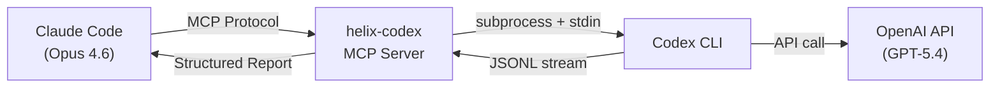
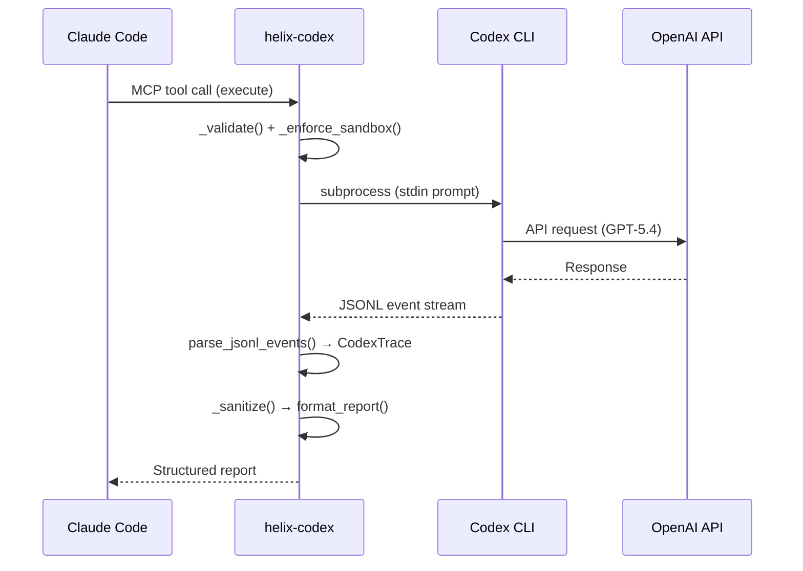

# helix-codex

[](LICENSE)
[](https://python.org)
[]()
[](https://modelcontextprotocol.io)

**Give Claude Code structured Codex traces, not raw output.**

For Claude Code users who want GPT-5.4 as a real tool: helix-codex parses the **entire JSONL event stream** from Codex CLI and returns a structured execution report -- which tools it used, which files it touched, how long it took, and what went wrong. No other Codex MCP bridge does this.



## Without vs With helix-codex

**Without** -- You call Codex CLI and get a wall of text. You don't know what tools it used, what files it changed, or if it actually succeeded.

**With helix-codex** -- Claude Code gets a structured execution trace:

```
[Codex gpt-5.4] Completed

⏱ Execution time: 8.3s
🧵 Thread: 019d436e-4c39-7093-b7ed-f8a26aca7938

📦 Tools used (3):
  ✅ read_file — src/auth.py
  ✅ edit_file — src/auth.py
  ✅ shell — python -m pytest tests/

📁 Files touched (1):
  • src/auth.py

━━━ Codex Response ━━━
Fixed the authentication logic. Token validation order was incorrect.
```

## Why helix-codex?

There are 6+ Codex MCP bridges on GitHub. Here's what makes this one different:

| | Other bridges | helix-codex |
|---|---|---|
| Output | Raw text dump | **Structured trace** (tools, files, timing, errors) |
| Parallel tasks | 1 at a time | **Up to 6 simultaneous** |
| Session continuity | Stateless | **threadId persistence** across calls |
| Security | Pass-through | **3-tier sandbox + terminal injection prevention** |
| Tests | Few or none | **56 tests** (parsing, security, sessions, edge cases) |
| Review | Basic or none | **Adversarial Review Loop** (GPT-5.4 challenges Claude's code) |

## Key Features

- **Full JSONL Trace Parsing** -- Every Codex event (tool calls, file ops, errors) parsed into a structured report
- **Parallel Execution** -- Run up to 6 Codex tasks simultaneously via `parallel_execute`
- **Session Management** -- Continue previous threads with `session_continue` (threadId persistence)
- **Adversarial Review Loop** -- GPT-5.4 reviews Claude's code from a different perspective
- **Sandbox Security** -- 3-tier policy (read-only / workspace-write / danger-full-access) + terminal injection prevention
- **Cross-Model Discussion** -- Get GPT-5.4's opinion on design decisions via `discuss`
- **Zero External Dependencies** -- Just FastMCP + Codex CLI. No databases, no Docker, no config files
- **Japanese Native** -- Full Japanese prompt and report support
- **56 Tests** -- Comprehensive coverage including security, parsing, session management, and edge cases

## Quick Start

### 1. Install Codex CLI

```bash
npm install -g @openai/codex
codex login
```

### 2. Install helix-codex

```bash
git clone https://github.com/tsunamayo7/helix-codex.git
cd helix-codex
uv sync
```

### 3. Add to your MCP client

**Claude Code** (`~/.claude/settings.json`):

```json
{
  "mcpServers": {
    "helix-codex": {
      "type": "stdio",
      "command": "uv",
      "args": ["run", "--directory", "/path/to/helix-codex", "python", "server.py"],
      "env": { "PYTHONUTF8": "1" }
    }
  }
}
```

<details>
<summary><b>Cursor</b> (~/.cursor/mcp.json)</summary>

```json
{
  "mcpServers": {
    "helix-codex": {
      "command": "uv",
      "args": ["run", "--directory", "/path/to/helix-codex", "python", "server.py"],
      "env": { "PYTHONUTF8": "1" }
    }
  }
}
```

</details>

<details>
<summary><b>VS Code / Windsurf</b></summary>

Add to your MCP settings:

```json
{
  "helix-codex": {
    "command": "uv",
    "args": ["run", "--directory", "/path/to/helix-codex", "python", "server.py"],
    "env": { "PYTHONUTF8": "1" }
  }
}
```

</details>

## Tools

| Tool | Description | Sandbox |
|------|-------------|---------|
| `execute` | Delegate tasks to Codex with structured trace report | workspace-write |
| `trace_execute` | Same as execute, plus full event timeline | workspace-write |
| `parallel_execute` | Run up to 6 tasks simultaneously | read-only |
| `review` | Adversarial code review by GPT-5.4 | read-only |
| `explain` | Code explanation (brief/medium/detailed) | read-only |
| `generate` | Code generation with optional file output | workspace-write |
| `discuss` | Get GPT-5.4's perspective on design decisions | read-only |
| `session_continue` | Continue a previous Codex thread | workspace-write |
| `session_list` | List session history with thread IDs | - |
| `status` | Check Codex CLI status and auth | - |

## Real-World Example: Adversarial Code Review

Claude Code writes code, then asks GPT-5.4 to review it:

```
[Codex Review] GPT-5.4 Review Result

⏱ Execution time: 15.7s

━━━ Codex Response ━━━
- [CRITICAL] `run(cmd)` calls `os.system(cmd)` directly -- command injection
  if `cmd` contains user input. Use `subprocess.run([...], shell=False)`.

- [WARNING] `divide(a, b)` raises ZeroDivisionError when b == 0.
  Add a pre-check or explicit error message.

- [INFO] No type hints on function signatures. Add `def divide(a: float,
  b: float) -> float:` for readability.
```

## Real-World Example: Parallel Execution

Analyze multiple tasks simultaneously:

```
[Parallel Execution Complete] 3 tasks

━━━ Task 1 ✅ ━━━
Instruction: Analyze src/auth.py for security issues
⏱ 5.2s
...

━━━ Task 2 ✅ ━━━
Instruction: Review database query patterns in src/db.py
⏱ 7.8s
...

━━━ Task 3 ✅ ━━━
Instruction: Check error handling in src/api.py
⏱ 4.1s
...
```

## Architecture



### Security Model

| Sandbox Mode | File Write | Shell Exec | Use Case |
|---|---|---|---|
| `read-only` | Blocked | Blocked | Review, explain, discuss |
| `workspace-write` | CWD only | Allowed | Execute, generate |
| `danger-full-access` | Anywhere | Allowed | Full system access (use with caution) |

**Additional protections:**
- ANSI/OSC escape sequence sanitization (terminal injection prevention)
- Input validation on all parameters
- Process kill on timeout
- `--ephemeral` flag (no persistent Codex state)

## Development

```bash
# Setup
git clone https://github.com/tsunamayo7/helix-codex.git
cd helix-codex
uv sync --extra dev

# Run tests (56 tests)
uv run pytest tests/ -v

# Run server directly
uv run python server.py
```

**Project structure:** Single file (`server.py`, ~820 lines). Easy to read, modify, and contribute.

## Use Cases

1. **Cross-Model Code Review** -- Claude writes code, GPT-5.4 reviews it. Eliminates single-model bias.
2. **Parallel Codebase Analysis** -- Analyze 6 files simultaneously, get structured reports for each.
3. **Design Discussion** -- Get GPT-5.4's alternative perspective on architectural decisions via `discuss`.
4. **Session-Based Refactoring** -- Large refactoring across multiple `session_continue` calls with context preservation.
5. **AI Second Opinion** -- When Claude's answer seems off, ask GPT-5.4 for a sanity check.

## Requirements

- Python 3.12+
- [Codex CLI](https://github.com/openai/codex) (`npm install -g @openai/codex`)
- OpenAI account (Codex CLI must be authenticated via `codex login`)
- [uv](https://github.com/astral-sh/uv) (recommended) or pip

## Related Projects

- [codex-plugin-cc](https://github.com/openai/codex-plugin-cc) -- Official OpenAI plugin for Claude Code
- [codex-mcp-server](https://github.com/tuannvm/codex-mcp-server) -- Alternative Codex MCP bridge (Node.js)

## License

[MIT](LICENSE)
