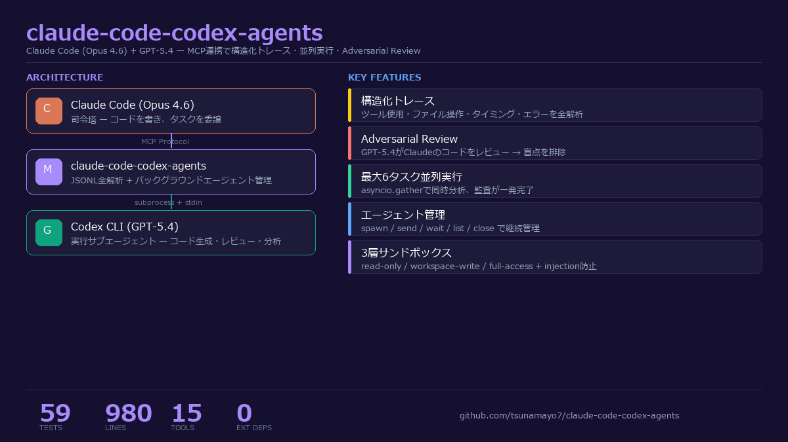
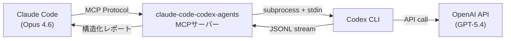

# claude-code-codex-agents

[](LICENSE)
[](https://python.org)
[]()
[](https://modelcontextprotocol.io)

**[English README](README.md)**

**Claude Codeに構造化されたCodexトレースを。生テキストではなく。**

Claude CodeユーザーがGPT-5.4を本格的なツールとして使うためのMCPサーバーです。claude-code-codex-agentsはCodex CLIの**JSONLイベントストリーム全体を解析**し、使用ツール・変更ファイル・実行時間・エラーを構造化レポートとして返します。他のCodex MCPブリッジにはこの機能はありません。





## Before / After

**Before（従来）** -- Codex CLIを呼ぶとテキストの壁が返ってくる。何のツールを使ったか、どのファイルを変更したか、成功したかも分からない。

**After（claude-code-codex-agents導入後）** -- Claude Codeが構造化された実行トレースを受け取る:

```
[Codex gpt-5.4] Completed

⏱ 実行時間: 8.3秒
🧵 Thread: 019d436e-4c39-7093-b7ed-f8a26aca7938

📦 使用ツール (3):
  ✅ read_file — src/auth.py
  ✅ edit_file — src/auth.py
  ✅ shell — python -m pytest tests/

📁 変更ファイル (1):
  • src/auth.py

━━━ Codex応答 ━━━
認証ロジックを修正しました。トークン検証の順序が不正でした。
```

## なぜ claude-code-codex-agents？

GitHub上にCodex MCPブリッジは6つ以上あります。このツールの違い:

| | 他のブリッジ | claude-code-codex-agents |
|---|---|---|
| 出力 | 生テキスト | **構造化トレース**（ツール・ファイル・タイミング・エラー） |
| 並列実行 | 1タスクずつ | **最大6タスク同時** |
| セッション継続 | ステートレス | **threadId永続化** |
| セキュリティ | パススルー | **3層サンドボックス + Terminal Injection防止** |
| テスト | 少数or無 | **59テスト** |
| レビュー | 基本or無 | **Adversarial Review Loop**（GPT-5.4がClaudeのコードをレビュー） |

## 主な機能

- **JSONLトレース全解析** -- Codexの全イベント（ツール呼び出し・ファイル操作・エラー）を構造化レポートに変換
- **並列実行** -- `parallel_execute`で最大6タスクを同時実行
- **セッション管理** -- `session_continue`で前回のスレッドを引き継ぎ（threadId永続化）
- **エージェントライフサイクル** -- `spawn_codex_agent` / `send_codex_agent_input` / `wait_codex_agent` でClaude Code風のバックグラウンドワーカーとして利用可能
- **Adversarial Review Loop** -- GPT-5.4がClaudeのコードを別視点でレビュー
- **サンドボックスセキュリティ** -- 3段階ポリシー（read-only / workspace-write / danger-full-access）+ Terminal Injection防止
- **クロスモデル議論** -- `discuss`でGPT-5.4の設計判断に関する見解を取得
- **外部依存ゼロ** -- FastMCP + Codex CLIのみ。DB不要、Docker不要、設定ファイル不要
- **日本語ネイティブ** -- プロンプト・レポート完全日本語対応
- **59テスト** -- セキュリティ・パース・セッション管理・エージェント管理・エッジケースを網羅

## クイックスタート

### 1. Codex CLIインストール

```bash
npm install -g @openai/codex
codex login
```

### 2. claude-code-codex-agentsインストール

```bash
git clone https://github.com/tsunamayo7/claude-code-codex-agents.git
cd claude-code-codex-agents
uv sync
```

### 3. MCPクライアントに追加

**Claude Code** (`~/.claude/settings.json`):

```json
{
  "mcpServers": {
    "claude-code-codex-agents": {
      "type": "stdio",
      "command": "uv",
      "args": ["run", "--directory", "/path/to/claude-code-codex-agents", "python", "server.py"],
      "env": { "PYTHONUTF8": "1" }
    }
  }
}
```

<details>
<summary><b>Cursor</b> (~/.cursor/mcp.json)</summary>

```json
{
  "mcpServers": {
    "claude-code-codex-agents": {
      "command": "uv",
      "args": ["run", "--directory", "/path/to/claude-code-codex-agents", "python", "server.py"],
      "env": { "PYTHONUTF8": "1" }
    }
  }
}
```

</details>

<details>
<summary><b>VS Code / Windsurf</b></summary>

MCP設定に以下を追加:

```json
{
  "claude-code-codex-agents": {
    "command": "uv",
    "args": ["run", "--directory", "/path/to/claude-code-codex-agents", "python", "server.py"],
    "env": { "PYTHONUTF8": "1" }
  }
}
```

</details>

## ツール一覧

| ツール | 説明 | サンドボックス |
|------|------|---------|
| `execute` | タスクをCodexに委譲し構造化トレースレポートを取得 | workspace-write |
| `trace_execute` | executeと同じ + 全イベントタイムライン付き | workspace-write |
| `parallel_execute` | 最大6タスクを同時実行 | read-only |
| `review` | GPT-5.4によるAdversarialコードレビュー | read-only |
| `explain` | コード解説（brief/medium/detailed） | read-only |
| `generate` | コード生成（ファイル出力オプション付き） | workspace-write |
| `discuss` | 設計判断についてGPT-5.4の見解を取得 | read-only |
| `session_continue` | 前回のCodexスレッドを引き継いで実行 | workspace-write |
| `session_list` | セッション履歴とスレッドIDの一覧 | - |
| `spawn_codex_agent` | `default` / `explorer` / `worker` ロールでバックグラウンドCodexワーカーを起動 | ロール依存 |
| `send_codex_agent_input` | 既存のCodexワーカーへ追加入力を送る | エージェント設定継承 |
| `wait_codex_agent` | エージェントの現在ターン完了を待ち、最後の構造化結果を取得 | - |
| `list_codex_agents` | 管理中のCodexエージェント一覧を表示 | - |
| `close_codex_agent` | アイドル状態のCodexエージェントをクローズ | - |
| `status` | Codex CLIの状態と認証確認 | - |

## Claude Code風エージェント

新しいエージェントライフサイクルツールにより、Codexを単発CLIではなく、Claude Codeのサブエージェントに近い形で扱えます。

- `spawn_codex_agent` でロール付きワーカーを起動
- `default`: バランス型
- `explorer`: 調査・読取寄り
- `worker`: 実装・検証寄り
- `send_codex_agent_input` で同じワーカーに継続指示を送信
- `wait_codex_agent` で非同期完了待ち
- `list_codex_agents` / `close_codex_agent` でアイドルワーカーを管理

## 実例: Adversarialコードレビュー

Claude Codeがコードを書き、GPT-5.4にレビューさせた結果:

```
[Codex Review] GPT-5.4 レビュー結果

⏱ 実行時間: 15.7秒

━━━ Codex応答 ━━━
- [CRITICAL] `run(cmd)` が `os.system(cmd)` を直接呼び出し -- コマンドインジェクション脆弱性
  → `subprocess.run([...], shell=False)` を使用してください。

- [WARNING] `divide(a, b)` で b == 0 の場合にZeroDivisionError。
  → 事前チェックまたは明示的なエラーメッセージを追加。

- [INFO] 関数シグネチャに型ヒントなし。
```

## セキュリティモデル

| サンドボックスモード | ファイル書込 | シェル実行 | 用途 |
|---|---|---|---|
| `read-only` | ブロック | ブロック | review, explain, discuss |
| `workspace-write` | CWDのみ | 許可 | execute, generate |
| `danger-full-access` | どこでも | 許可 | フルアクセス（要注意） |

**追加の防御:**
- ANSI/OSCエスケープシーケンスのサニタイズ（Terminal Injection防止）
- 全パラメータの入力バリデーション
- タイムアウト時のプロセスkill
- `--ephemeral`フラグ（Codex側に永続状態を持たせない）

## 開発

```bash
# セットアップ
git clone https://github.com/tsunamayo7/claude-code-codex-agents.git
cd claude-code-codex-agents
uv sync --extra dev

# テスト実行（59テスト）
uv run pytest tests/ -v

# サーバー直接起動
uv run python server.py
```

**プロジェクト構成:** 単一ファイル（`server.py`、約820行）。読みやすく、改変・貢献が容易。

## ユースケース

1. **クロスモデルコードレビュー** -- Claudeがコードを書き、GPT-5.4がレビュー。単一モデルのバイアスを排除
2. **並列コードベース分析** -- 6ファイルを同時分析、各ファイルの構造化レポートを取得
3. **設計議論** -- `discuss`でアーキテクチャ判断についてGPT-5.4の代替視点を取得
4. **セッションベースリファクタリング** -- 複数の`session_continue`呼び出しで大規模リファクタリングをコンテキスト保持しながら実行
5. **AIセカンドオピニオン** -- Claudeの回答に違和感がある時、GPT-5.4にサニティチェック

## 要件

- Python 3.12+
- [Codex CLI](https://github.com/openai/codex) (`npm install -g @openai/codex`)
- OpenAIアカウント（`codex login`で認証済みであること）
- [uv](https://github.com/astral-sh/uv)（推奨）またはpip

## 関連プロジェクト

- [codex-plugin-cc](https://github.com/openai/codex-plugin-cc) -- OpenAI公式 Claude Codeプラグイン
- [codex-mcp-server](https://github.com/tuannvm/codex-mcp-server) -- 代替Codex MCPブリッジ（Node.js）

## ライセンス

[MIT](LICENSE)
