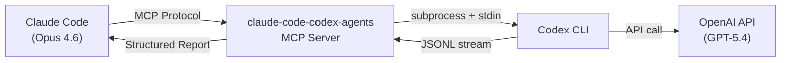
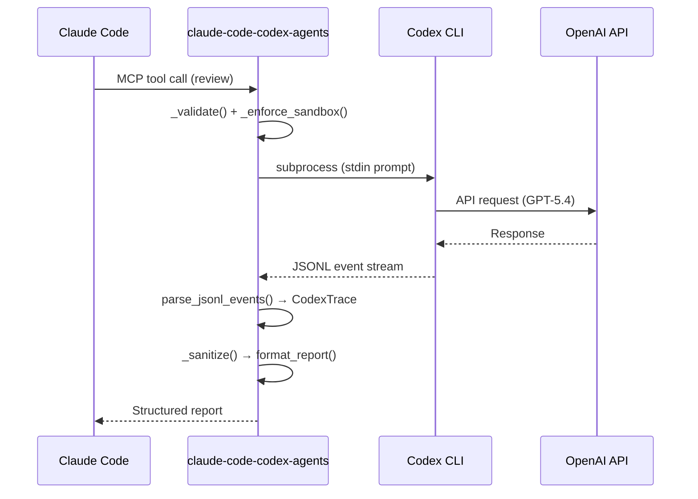

## The Problem Every AI Power User Hits

You're deep in a Claude Code session. The code looks good — but something nags you. **Claude wrote the code and Claude reviewed the code.** Same model, same blind spots.

You open a second terminal, paste the code into Codex CLI, wait for GPT-5.4's response, then manually copy the feedback back. You've done this dance a dozen times today, and it's 2026 — this should be automated.

That's exactly why I built **claude-code-codex-agents**.

## What Is claude-code-codex-agents?

An MCP server that lets Claude Code call Codex CLI (GPT-5.4) as a structured tool — not a raw text dump, but a parsed execution trace with timing, tool calls, files touched, and error classification.



One `server.py` file (~820 lines). No databases, no Docker, no config files. Just FastMCP + Codex CLI.

## Before vs After

**Before claude-code-codex-agents** — You call Codex CLI from terminal and get a wall of unstructured text. You don't know what tools it used, what files it changed, or if it actually succeeded. Copying results back to Claude Code is manual and error-prone.

**After claude-code-codex-agents** — Claude Code gets a structured execution trace it can reason about:

```
[Codex gpt-5.4] Completed

⏱ Execution time: 8.3s
🧵 Thread: 019d436e-4c39-7093-b7ed-f8a26aca7938

📦 Tools used (3):
  ✅ read_file — src/auth.py
  ✅ edit_file — src/auth.py
  ✅ shell — python -m pytest tests/

📁 Files touched (1):
  • src/auth.py

━━━ Codex Response ━━━
Fixed the authentication logic. Token validation order was incorrect.
```

Claude sees exactly what happened — timing, tools, files, success/failure — and can make informed decisions about the next step.

## Real Results: 4 Things That Actually Happened

### 1. Adversarial Review in 15.7 Seconds

Claude Code wrote a Python module. I asked claude-code-codex-agents to have GPT-5.4 review it. The `review` tool returned in **15.7 seconds** with findings classified by severity:

```
[Codex Review] GPT-5.4 Review Result

⏱ Execution time: 15.7s

━━━ Codex Response ━━━
- [CRITICAL] `run(cmd)` calls `os.system(cmd)` directly -- command injection
  if `cmd` contains user input. Use `subprocess.run([...], shell=False)`.

- [WARNING] `divide(a, b)` raises ZeroDivisionError when b == 0.
  Add a pre-check or explicit error message.

- [INFO] No type hints on function signatures. Add `def divide(a: float,
  b: float) -> float:` for readability.
```

CRITICAL / WARNING / INFO classification — not just "here are some suggestions." Claude Code can immediately prioritize which issues to fix first.

### 2. Cross-Model Design Discussion

I had Claude and Codex both analyze a singleton pattern implementation. Using the `discuss` tool, GPT-5.4 proposed an alternative:

> "Instead of a class-level `_instance` with `__new__`, consider `@functools.lru_cache(maxsize=1)` on a factory function. Simpler, thread-safe by default, and easier to test by clearing the cache."

Claude Code evaluated both approaches and adopted the `lru_cache` version. **Two models, two perspectives, better code.**

### 3. Parallel Execution: 3 Tasks Simultaneously

The `parallel_execute` tool runs up to 6 Codex tasks concurrently:

```
[Parallel Execution Complete] 3 tasks

━━━ Task 1 ✅ ━━━
Instruction: Analyze src/auth.py for security issues
⏱ 5.2s

━━━ Task 2 ✅ ━━━
Instruction: Review database query patterns in src/db.py
⏱ 7.8s

━━━ Task 3 ✅ ━━━
Instruction: Check error handling in src/api.py
⏱ 4.1s
```

Total wall-clock time: **7.8 seconds** (not 17.1s sequential). Each task gets its own structured trace.

### 4. GPT-5.4 Reviews claude-code-codex-agents's Own Code

The most meta test: I pointed GPT-5.4 at claude-code-codex-agents's own `server.py`. It found **3 CRITICAL issues**:

- A regex pattern that could cause catastrophic backtracking on crafted input
- A session list that grew unboundedly (no max-size enforcement in one path)
- A timeout race condition where process kill didn't await cleanup

All three were real bugs. All three were fixed. **The tool improved itself.**

## How It Compares to Other Codex MCP Bridges

There are 6+ Codex MCP bridges on GitHub. Here's the honest comparison:

| | Other bridges | claude-code-codex-agents |
|---|---|---|
| Output format | Raw text dump | **Structured trace** (tools, files, timing) |
| Parallel tasks | 1 at a time | **Up to 6 simultaneous** |
| Session continuity | Stateless | **threadId persistence** across calls |
| Security | Pass-through | **3-tier sandbox** + terminal injection prevention |
| Tests | Few or none | **56 tests** |
| Code review | Basic or none | **Adversarial Review Loop** |

The key differentiator: claude-code-codex-agents parses the **entire JSONL event stream** from Codex CLI. Every tool call, every file operation, every error gets captured in a structured `CodexTrace` object. Other bridges just capture stdout.

## Architecture: How the JSONL Parsing Works



The security model uses three sandbox tiers:

- **read-only** — File writes and shell execution blocked (for `review`, `explain`, `discuss`)
- **workspace-write** — CWD-only writes allowed (for `execute`, `generate`)
- **danger-full-access** — Full system access (use with caution)

All output passes through ANSI/OSC sanitization to prevent terminal injection attacks.

## Get Started in 3 Minutes

```bash
# 1. Install Codex CLI
npm install -g @openai/codex
codex login

# 2. Clone and install
git clone https://github.com/tsunamayo7/claude-code-codex-agents.git
cd claude-code-codex-agents
uv sync

# 3. Add to Claude Code (~/.claude/settings.json)
```

```json
{
  "mcpServers": {
    "claude-code-codex-agents": {
      "type": "stdio",
      "command": "uv",
      "args": ["run", "--directory", "/path/to/claude-code-codex-agents", "python", "server.py"],
      "env": { "PYTHONUTF8": "1" }
    }
  }
}
```

That's it. Claude Code now has GPT-5.4 as a structured tool.

## What I Learned

1. **Single-model review is a blind spot.** Claude reviewing Claude's code misses the same categories of bugs. Cross-model review caught real issues.
2. **Structured output beats raw text.** When Claude Code gets a parsed trace instead of a text wall, it makes better follow-up decisions.
3. **Parallel execution changes workflow.** Reviewing 6 files in the time of 1 is not just faster — it changes how you approach codebase analysis.

## Links

- **GitHub**: [tsunamayo7/claude-code-codex-agents](https://github.com/tsunamayo7/claude-code-codex-agents)
- **License**: MIT
- **Requirements**: Python 3.12+, Codex CLI, OpenAI account

---

*claude-code-codex-agents is part of the Helix toolkit — a collection of MCP servers for extending Claude Code with real capabilities. Star the repo if cross-model AI collaboration interests you.*
