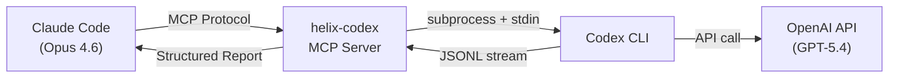

## はじめに：AIに「手足」を与える

Claude Code (Opus 4.6) は優秀だが、**単一モデルのバイアス**からは逃れられない。自分が書いたコードを自分でレビューしても、同じ盲点を見逃す。

そこで考えた。**GPT-5.4を「手足」として使えば、別の視点からコードを検証できるのではないか？**

[helix-codex](https://github.com/tsunamayo7/helix-codex) は、Claude CodeからCodex CLI (GPT-5.4) をMCPツールとして呼び出し、**実行過程を構造化レポートとして返す**MCPサーバーだ。ただのプロキシではない。JSONLイベントストリームを完全解析し、ツール使用・ファイル操作・タイミング・エラーをすべて可視化する。



## 実動作結果：数字で語る

まず、実際に動かした結果を見てほしい。

| ツール | 所要時間 | 結果 |
|--------|----------|------|
| `status` | 即時 | Codex CLI 0.116.0、認証済み |
| `explain` | 5.4秒 | フィボナッチ関数を日本語で解説 |
| `review` | 15.7秒 | `os.system`のコマンドインジェクションを検出 |
| `execute` | 2.8秒 | threadId取得成功 |
| `session_continue` | - | 前回セッション引き継ぎで「300」正答 |

特に`review`の結果が面白い。GPT-5.4は15.7秒で以下を検出した：

```
[Codex Review] GPT-5.4によるレビュー結果

⏱ 実行時間: 15.7秒

━━━ Codex応答 ━━━
- [CRITICAL] `run(cmd)` calls `os.system(cmd)` directly -- command injection
  if `cmd` contains user input. Use `subprocess.run([...], shell=False)`.

- [WARNING] `divide(a, b)` raises ZeroDivisionError when b == 0.
  Add a pre-check or explicit error message.

- [INFO] No type hints on function signatures.
```

## 技術的深掘り：JSONLストリーム解析の仕組み

helix-codexの核心は、Codex CLIが吐く**JSONLイベントストリームの完全解析**にある。

Codex CLIを`--json`フラグで実行すると、1行1JSONのイベントストリームが返る。イベントの種類は `thread.started`、`item.created`、`item.completed`、`turn.completed`、`error` など多岐にわたる。

```python
def parse_jsonl_events(output: str, trace: CodexTrace) -> None:
    """Codex CLIのJSONL出力を解析してトレースに記録"""
    parse_errors = 0
    for line in output.strip().splitlines():
        if not line.strip():
            continue
        try:
            event = json.loads(line)
        except json.JSONDecodeError:
            parse_errors += 1
            continue

        event_type = event.get("type", "")
        trace.add_event(event_type, event)

        # スレッド開始
        if event_type == "thread.started":
            trace.thread_id = event.get("thread_id") or event.get("threadId")

        # ツール呼び出し完了
        elif event_type == "item.completed":
            item = event.get("item", {})
            item_type = item.get("type", "")

            if item_type == "function_call":
                # ツール名・ステータス・引数を抽出
                tc = {
                    "name": str(item.get("name", "unknown")),
                    "status": str(item.get("status", "completed")),
                    "detail": "",
                }
                # 引数からファイルパスやコマンドを追跡
                args = item.get("arguments", "")
                if isinstance(args, str):
                    try:
                        args_dict = json.loads(args)
                        path = args_dict.get("path") or args_dict.get("file_path", "")
                        if path:
                            tc["detail"] = str(path)
                            trace.files_touched.append(str(path))
                    except json.JSONDecodeError:
                        pass
                trace.tool_calls.append(tc)
```

ポイントは3つ：

1. **行単位のJSON解析** — JSONL形式なので、壊れた行があってもスキップして続行できる
2. **ツール引数の二重パース** — `item.arguments`は文字列化されたJSONなので、もう一度`json.loads`する必要がある
3. **ファイル操作の自動追跡** — `path`や`file_path`キーを持つツール呼び出しを検出し、`files_touched`に記録

最終的に`CodexTrace`データクラスに集約され、`format_report()`で人間が読めるレポートに変換される。

## Adversarial Review Loop：GPT-5.4がhelix-codex自身をレビュー

ここからが本題。**helix-codex自身のコード（server.py）をGPT-5.4にレビューさせた。**

Claude Codeがserver.pyを書き、そのserver.py経由でGPT-5.4にレビューを依頼する。自分で自分を検証するメタ的な構造だ。

### 検出されたCRITICAL 3件

GPT-5.4は以下の3件のCRITICALを検出した：

#### 1. returncodeの判定漏れ

```python
# 修正前: stderrの有無だけでエラー判定
if stderr_text:
    trace.errors.append(stderr_text)

# 修正後: 非0終了は常にfailure（部分出力があっても）
if proc.returncode != 0:
    trace.errors.append(f"exit code {proc.returncode}: {stderr_text or '(no stderr)'}")
```

`returncode`が非0でもstderrが空なケースがあり、成功と誤判定していた。GPT-5.4はこれを即座に指摘した。

#### 2. Terminal Injection（制御文字インジェクション）

Codexの出力にANSI/OSCエスケープシーケンスが含まれていた場合、そのままターミナルに表示するとカーソル移動やOSCハイパーリンクで**任意コマンド実行**のリスクがある。

```python
# 追加されたサニタイズ処理
_CONTROL_RE = re.compile(
    r"\x1b\[[0-9;]*[a-zA-Z]"      # CSI sequences
    r"|\x1b\][^\x07]*\x07"        # OSC sequences
    r"|\x1b[^[\]()]"              # Other ESC sequences
    r"|[\x00-\x08\x0b\x0c\x0e-\x1f\x7f]"  # C0 control chars
)

def _sanitize(text: str) -> str:
    """制御文字・ANSIエスケープシーケンスを除去"""
    return _CONTROL_RE.sub("", text)
```

`format_report()`内のすべての出力箇所で`_sanitize()`を通すようにした。

#### 3. cwdの二重適用

```python
# 修正前: -Cフラグとsubprocessのcwdの両方にパスを渡していた
cmd = [codex_path, "exec", "-C", cwd, ...]
proc = await asyncio.create_subprocess_exec(*cmd, cwd=cwd)

# 修正後: subprocessのcwdのみで指定
def _build_cmd(codex_path, model, sandbox):
    """cwdはsubprocess側で指定、-Cとの二重適用を防ぐ"""
    return [codex_path, "exec", "--json", "--model", model, ...]
```

`-C`フラグとsubprocessの`cwd`引数が両方cwdを設定すると、相対パスの場合に二重適用される問題。

### なぜ同じAI同士でもバイアスが減るのか

Claude (Opus 4.6) とGPT-5.4はアーキテクチャ・学習データ・アライメント手法がすべて異なる。同じコードを見ても**注目する箇所が違う**。

- Claudeは構造やアーキテクチャの整合性に強い
- GPT-5.4はエッジケースやセキュリティの穴を突くのが得意

この相補性が、Adversarial Review Loopの価値だ。

## 並列実行：6タスク同時処理

`parallel_execute`ツールは、最大6つのタスクを`asyncio.gather`で並列実行する。

```python
@mcp.tool()
async def parallel_execute(tasks: str, model: str = "gpt-5.4",
                           sandbox: str = "read-only", ...):
    task_list = [t.strip() for t in tasks.strip().split("\n") if t.strip()]
    if len(task_list) > 6:
        return "[エラー] 並列タスクは最大6つまでです"

    results = await asyncio.gather(*[
        run_codex(prompt=task, model=model, sandbox=sandbox, ...)
        for task in task_list
    ])
```

実際にClaude + Codexの同列並列実行で、**シングルトンパターンの比較分析**をさせたところ、GPT-5.4は`lru_cache`を使った独自の実装を提案してきた。Claudeが提案するメタクラスベースの実装とは異なるアプローチで、こういう**モデル間の多様性**がAIツール連携の強みだ。

## セキュリティ設計：3層サンドボックス

helix-codexは3層のサンドボックスポリシーを実装している。

| モード | ファイル書込 | シェル実行 | 用途 |
|--------|-------------|-----------|------|
| `read-only` | 禁止 | 禁止 | review, explain, discuss |
| `workspace-write` | CWD内のみ | 許可 | execute, generate |
| `danger-full-access` | 全域 | 許可 | フルアクセス（要注意） |

```python
SANDBOX_POLICIES = {
    "read-only": {
        "blocked_tools": {"execute", "generate"},
        "allowed_codex_sandbox": "read-only",
    },
    "workspace-write": {
        "blocked_tools": set(),
        "allowed_codex_sandbox": "workspace-write",
    },
}

def _enforce_sandbox(tool_name: str, sandbox: str) -> Optional[str]:
    policy = SANDBOX_POLICIES.get(sandbox)
    if tool_name in policy["blocked_tools"]:
        return f"[セキュリティ] '{tool_name}' は sandbox='{sandbox}' では使用できません。"
    return None
```

加えて以下の防御層がある：

- **Terminal Injection防止**: 全出力のANSI/OSC/C0制御文字をサニタイズ
- **入力バリデーション**: 空プロンプト、無効なsandboxモードを拒否
- **タイムアウト+プロセスkill**: 無限ループ防止
- **`--ephemeral`フラグ**: Codex CLI側に永続状態を持たせない

## セッション継続：threadIdによるコンテキスト保持

Codex CLIは`threadId`でセッションを管理する。helix-codexはこれを`SessionManager`で追跡し、後続の呼び出しで前回のコンテキストを引き継げる。

実際のテストでは、最初のセッションで`100 + 200の計算結果を覚えておいて`と依頼し、`session_continue`で`さっきの計算結果は？`と聞いたところ、**「300」と正答した**。

```python
@mcp.tool()
async def session_continue(prompt: str, thread_id: str = "", ...):
    session = sessions.get_by_thread(thread_id) if thread_id else sessions.get_latest()

    continuation = (
        f"前回の実行（thread: {session.thread_id}）の続きです。\n"
        f"前回の指示: {session.prompt}\n"
        f"前回の結果概要: {session.summary}\n\n"
        f"続きの指示: {prompt}"
    )
    result = await run_codex(prompt=continuation, ...)
```

## 他のCodex MCPブリッジとの違い

GitHub上にはCodex MCPブリッジが6つ以上存在する。helix-codexの差別化ポイント：

| | 他のブリッジ | helix-codex |
|---|---|---|
| 出力 | 生テキスト | **構造化トレース**（ツール・ファイル・タイミング・エラー） |
| 並列実行 | 1タスクずつ | **最大6同時** |
| セッション継続 | ステートレス | **threadId永続化** |
| セキュリティ | パススルー | **3層サンドボックス + Terminal Injection防止** |
| テスト | 少数or無 | **56テスト** |
| レビュー | 基本or無 | **Adversarial Review Loop** |

## プロジェクト構成

全体が**server.py 1ファイル（約820行）**で完結している。外部依存はFastMCPのみ。

```
helix-codex/
├── server.py          # MCPサーバー本体（全ロジック）
├── tests/
│   └── test_server.py # 56テスト
├── pyproject.toml
└── README.md
```

## セットアップ

```bash
# 1. Codex CLIインストール
npm install -g @openai/codex
codex login

# 2. helix-codexインストール
git clone https://github.com/tsunamayo7/helix-codex.git
cd helix-codex
uv sync

# 3. Claude Codeに追加（~/.claude/settings.json）
```

```json
{
  "mcpServers": {
    "helix-codex": {
      "type": "stdio",
      "command": "uv",
      "args": ["run", "--directory", "/path/to/helix-codex", "python", "server.py"],
      "env": { "PYTHONUTF8": "1" }
    }
  }
}
```

## まとめ：AIがAIをレビューする意味

helix-codexで実現したのは、単なるAPI橋渡しではない。

1. **Adversarial Review Loop** — 異なるモデルによる相互検証でバイアスを低減
2. **構造化トレース** — 何が起きたか分からない「ブラックボックス」を解消
3. **セッション継続** — 長期タスクを分割して実行可能
4. **セキュリティ多層防御** — サンドボックス + サニタイズ + バリデーション

GPT-5.4がhelix-codex自身のCRITICAL 3件を検出した事実は、**単一モデルでの開発には限界がある**ことを示している。AIがAIをレビューする時代は、すでに始まっている。

---

GitHub: https://github.com/tsunamayo7/helix-codex
ライセンス: MIT
